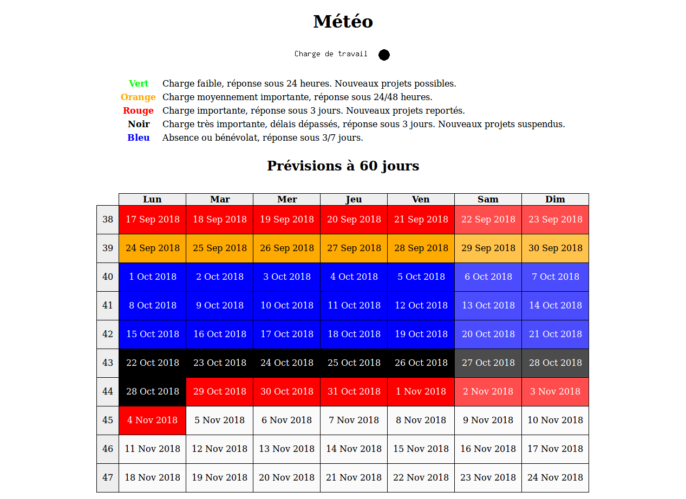

# Weather Table

The purpose of this software iss to display an availability table, based on a CalDAV calendar.

Every event has a color as title : blue,orange,red,black. All the events are retrieved from the calendar, and sorted to display an HTML table with every event title set as the class on the day cell.

It also generates images for the current day, to embed in mails or website.

This software uses ICS Parser to parse the retrieved events (the obsolete one: https://github.com/MartinThoma/ics-parser ).

## Installation

Edit the file config.php to add your own CalDAV URL and credentials.

## Screenshot

